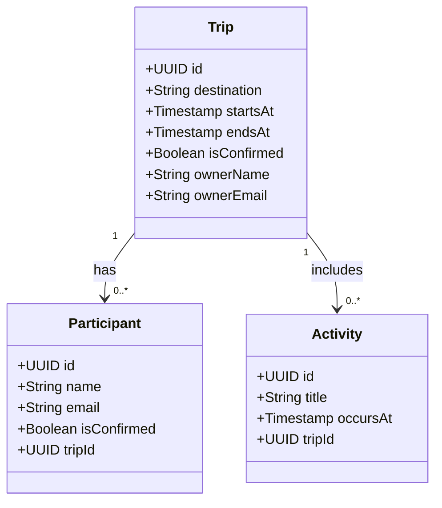

## ✈️ Planner API

Planner is a **travel planning API** that helps you organize and plan your trips. You can select dates and destinations, and share your plans with friends to collaborate on the trip details.

### 🚀 Features

- **Create and Edit a Trip**: Easily set up a new trip or modify the existing trip details.
- **Invite Guests**: Invite friends via email to collaborate on planning.
- **Add Activities**: Add and organize activities for the trip.

### 🗂 Domain Class Diagram

---

This project was developed during the Decola Tech Bootcamp - Avanade.
